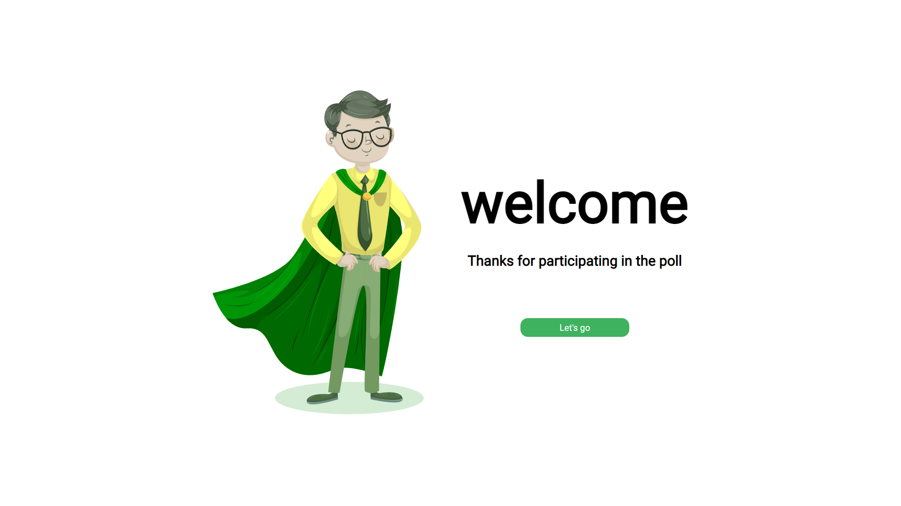
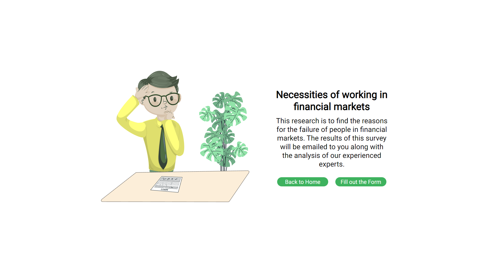
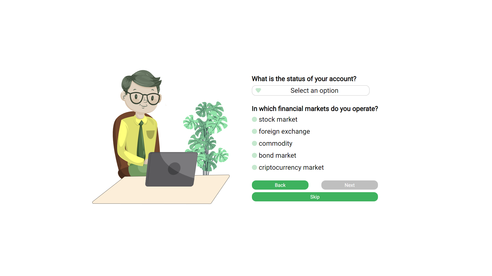
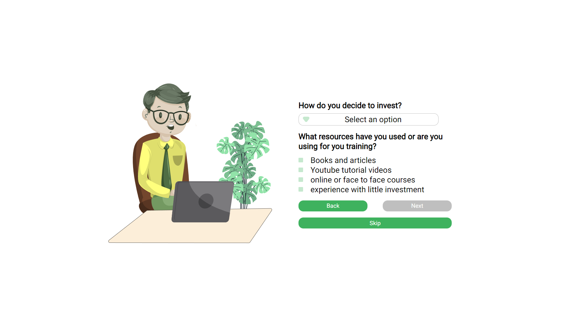
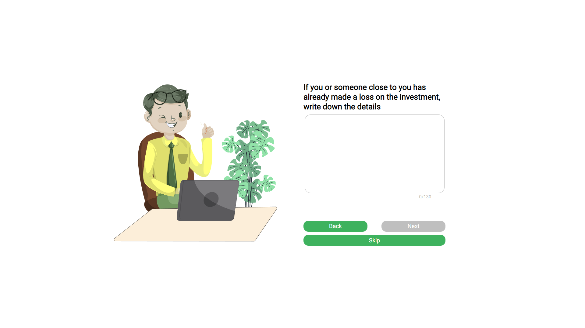
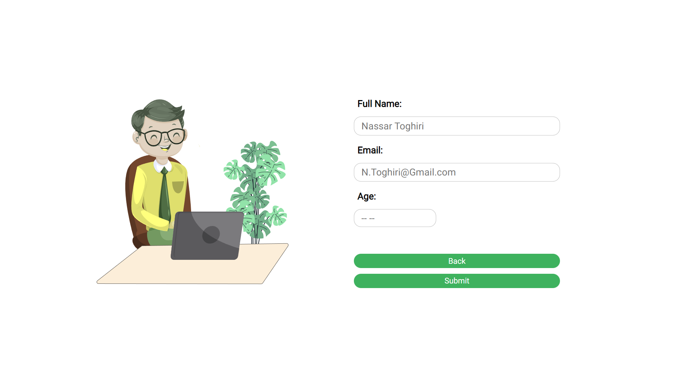
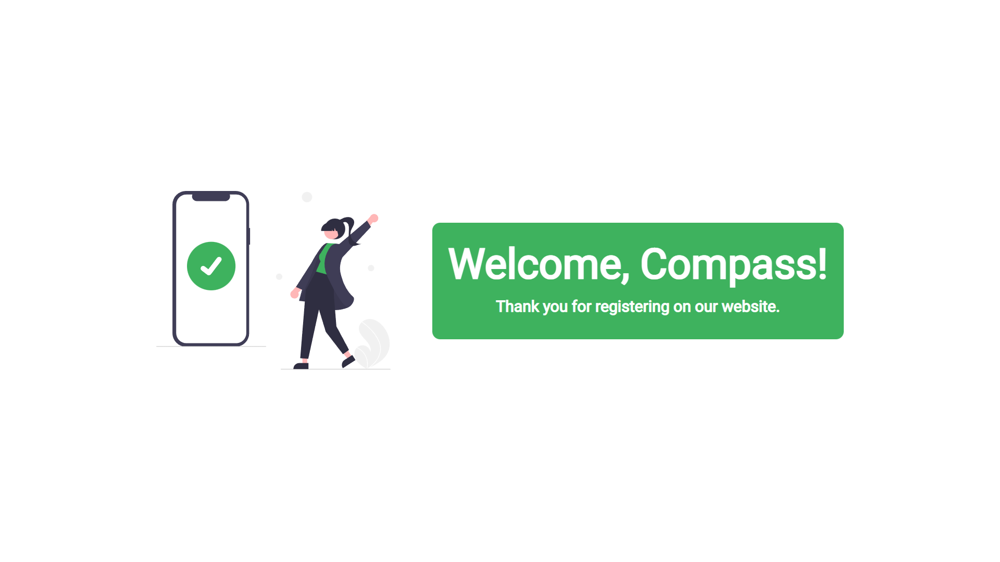

# Survey Form - Primeiro projeto do Programa de Bolsas da Compass.UOL

## Como preparar o ambiente?

Antes de tudo, é necessário ter o NodeJS e o NPM instalado em seu computador. Basta instalar através desse <a href="https://nodejs.org/en/">link</a>.

---

Abra o terminal no diretório em questão e execute o seguinte comando:

```
npm install
```

Para rodar a aplicação em seu computador, utilize o comando:

```
npm start
```

# Navegando pela aplicação

## Página inicial



## Segunda página



## Terceira Página



## Quarta Página



## Quinta Página



## Sexta Página



## Página após finalizar o cadastro



---

## Funcionalidades:

<ul>
    <li>Responsividade em todas as páginas</li>
    <li>Armazenamento dos inputs de cadastro em localStorage</li>
    <li>Sinalização e validação do número de caracteres no textArea</li>
    <li>Tela de sucesso após finalizar cadastro</li>
</ul>

---

## Tecnologias

<ul>
<li>HTML</li>
<li>CSS</li>
<li>TypeScript</li>
</ul>
